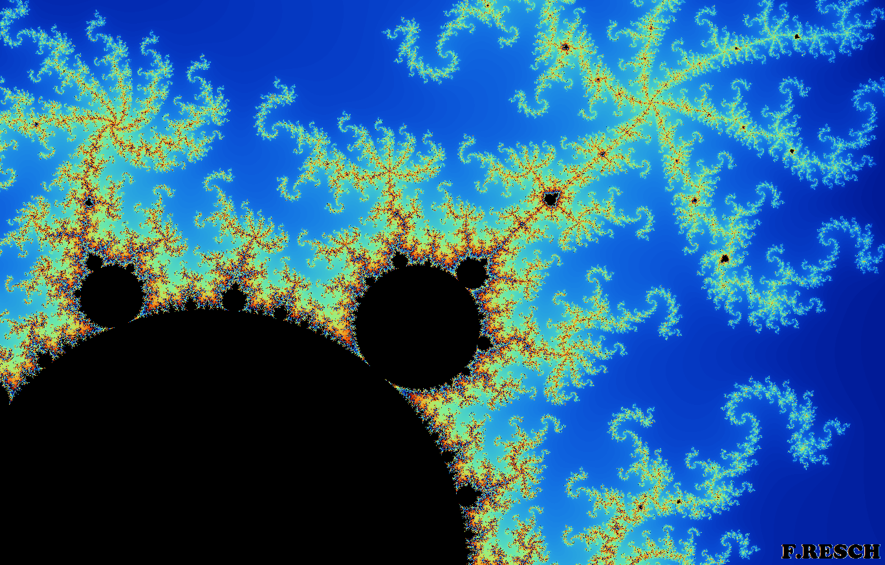

# complex-fractals
Rendering of Mandelbrot set and Julia sets in Java

## Useful resources
Efficiently generating the Mandelbrot and Julia sets: https://theses.liacs.nl/pdf/2018-2019-JonckheereLSde.pdf
Deep-Zoom: https://de.wikipedia.org/wiki/Mandelbrot-Menge#Deep_Zoom

## Example
